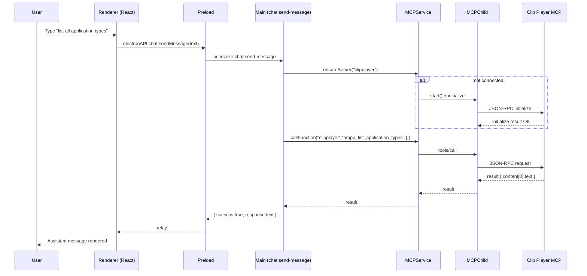
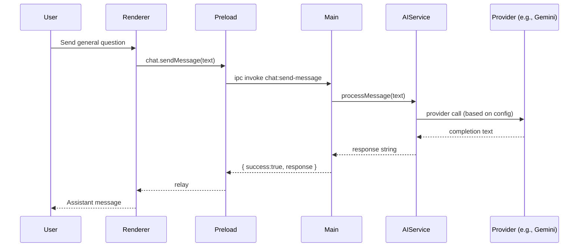
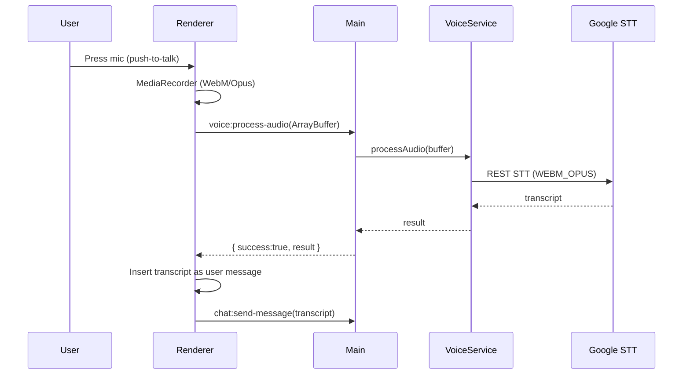
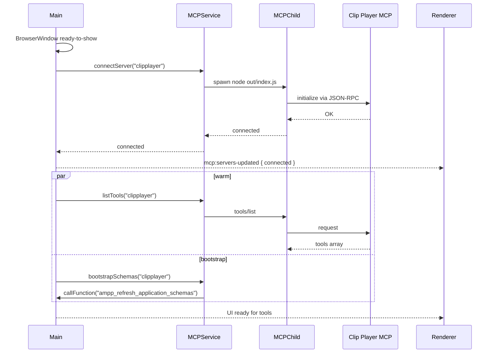

# OctAIvius System Architecture

This document explains how the Electron app, React renderer, AI, Voice, and MCP pieces link together, with end‑to‑end event flows and data boundaries.

## Viewing these diagrams

If your Markdown viewer doesn’t render Mermaid blocks (```mermaid):

- In VS Code 1.95 or newer: enable Settings → “Markdown: Mermaid Enabled”.
- Or install the “Markdown Preview Mermaid Support” extension (bierner.markdown-mermaid).
- Make sure your workspace is trusted (VS Code will block scripts in untrusted workspaces).
- On GitHub, diagrams render in the web UI automatically.

## Big picture

```mermaid
flowchart LR
  U[User] --> R[Renderer (React)]
  R --> P[Preload bridge]
  P --> M[Main (Electron)]
  M --> AIS[AIService]
  M --> MCPS[MCPService]
  M --> VS[VoiceService]
  AIS --> AIP[Providers<br/>(OpenAI/Gemini/Anthropic)]
  MCPS --> CH[MCPChild<br/>(stdio transport)]
  CH --> Srv[Clip Player MCP<br/>(child process)]
  VS --> GCP[Google Speech-to-Text]
```

Key boundaries

- Renderer has no Node access; it talks to Main via the preload bridge (context isolation).
- Main owns OS/process operations, AI/MCP/Voice services, and IPC handlers.
- MCP servers run as separate child processes over JSON‑RPC (stdio) via MCPChild.

## Core components

- Renderer (React): chat UI, header (frameless controls), settings, MCP panel.
- Preload: exposes safe APIs (chat, ai, mcp, voice, conversation, app, windowCtrl).
- Main: creates BrowserWindow, handles IPC, auto‑connects MCP, and routes chat to AI or MCP.
- MCPService: spawns/monitors MCP child, initializes protocol, tools/list, tools/call, schema bootstrap.
- AIService: orchestrates providers using core modules (conversation, processors, init, tests, mock).
- VoiceService: receives audio buffers and calls Google STT (WEBM_OPUS).

## Sequence: NL query to AMPP tool



Notes

- If intent is MCP‑related but no pattern matches, Main returns a short help list instead of falling back to AI.
- After initial connect, schemas are auto‑refreshed once and tools are warmed (tools/list) for faster UX.

## Sequence: Default AI response



## Sequence: Voice dictation to chat



## Sequence: App start → MCP connect → schema bootstrap



## IPC, contracts, and errors

IPC channels (preload ↔ main)

- chat:send-message(text) → { success, response? , error? }
- conversation:get-history → { success, history? }
- conversation:clear → { success }
- mcp:list-servers → { success, servers }
- mcp:connect-server(id) → { success }
- mcp:list-tools(id) → { success, tools }
- mcp:call-function(id,name,args) → { success, result }
- mcp:bootstrap-schemas(id) → { success }
- voice:process-audio(buf) → { success, result? , error? }
- window:close → { success }
- app:get-config → { success, config }

Common error modes

- MCP unavailable/slow: initialize or tools/list can time out; logs will show warnings and retries. Guidance fallback helps users rephrase.
- STT failures: surfaced as assistant error text; media capture errors are reported and tracks are cleaned up.
- Provider errors: AIService returns an error string; renderer displays a friendly message.

## Security and windowing

- Context isolation; only the preload bridge is exposed.
- CSP allows image data/blob for SVG icons; scripts/styles limited to self with minimal inline where required by framework.
- Frameless window; header area is draggable and controls are marked no‑drag; Close handled via IPC in main.

## Where things live

- Main and preload: `src/main.ts`, `src/preload.ts`
- Services
  - AI: `src/services/aiService.ts` + `src/services/ai/core/*`
  - Voice: `src/services/voiceService.ts`, `src/services/voice/sttGoogle.ts`
  - MCP: `src/services/mcpService.ts`, `src/services/mcp/{child.ts, types.ts, bootstrap.ts}`
- Renderer
  - Entry: `src/renderer/react/index.html`, `main.tsx`
  - UI: `src/renderer/react/components/*`

## Tips

- Natural‑language MCP is handled entirely in main’s chat handler—regex first, then MCP guidance fallback, and only then AI.
- Keep MCP servers compiled and clean on stdout. Use stderr for logs.
- The first successful MCP connection will automatically refresh schemas and warm the tool list.
